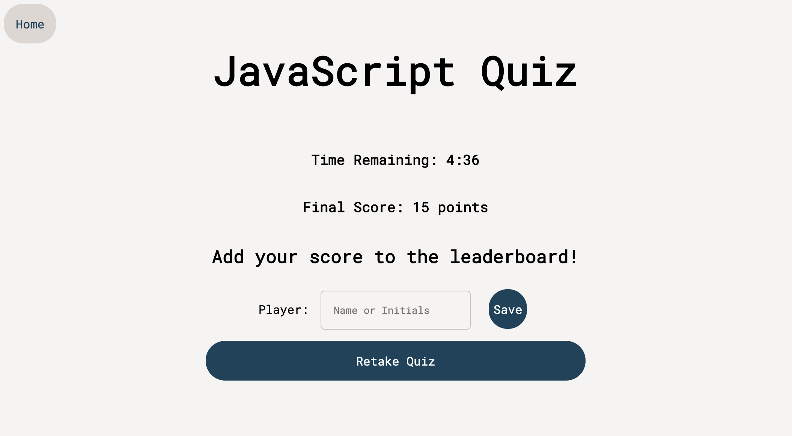

# Code Quiz
deployed project:https://vanessalane.github.io/code-quiz/

## Description
A JS app that quizzes users on basic JS and stores high scores in LocalStorage.

## User Story
**As a** coding boot camp student, **I want** to take a timed quiz on JavaScript fundamentals that stores high scores **so that** I can gauge my progress compared to my peers.

## Questions
If you have questions, email me at [vlane0593@gmail.com](mailto:vlane0593@gmail.com) or reach out on [GitHub](https://www.github.com/vanessalane).

# Screenshots
## Home Page

## Quiz Question

## Finish Page

## Leaderboard

